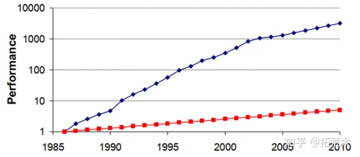
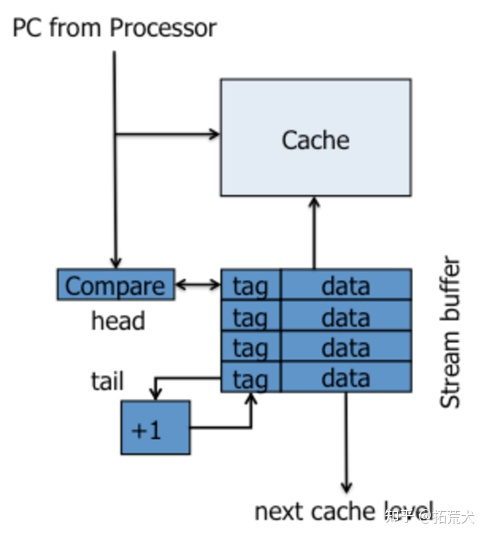
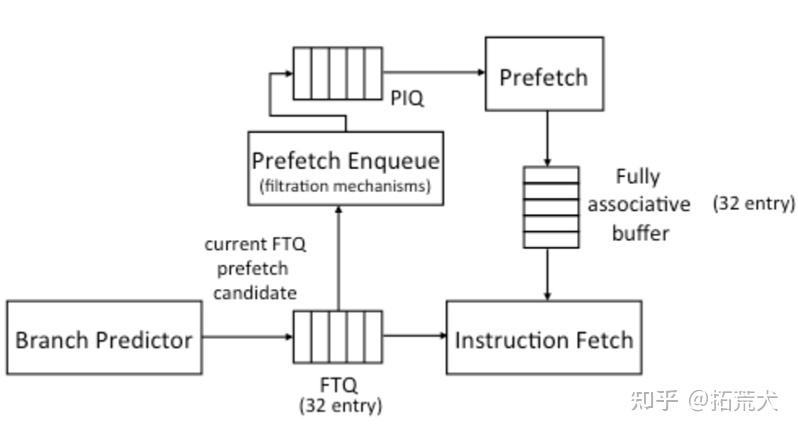
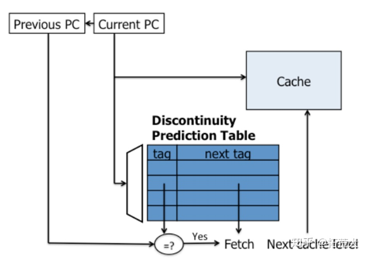
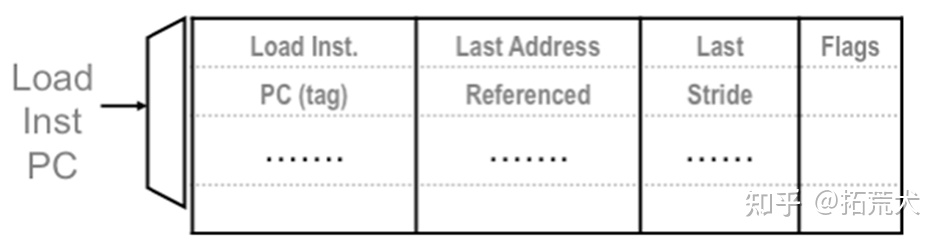
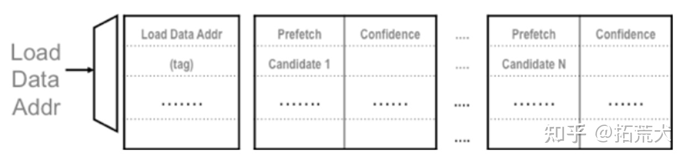
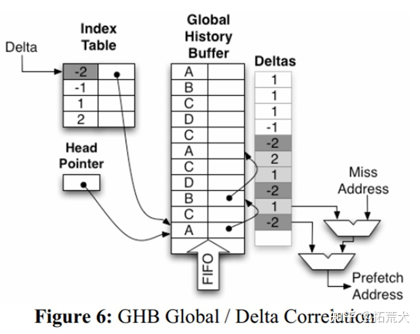

体系结构期末大作业实验报告
==================================

-----

>专业：计算机科学与技术
>学号：2011188
>姓名：邵琦


<!-- @import "[TOC]" {cmd="toc" depthFrom=1 depthTo=6 orderedList=false} -->

<!-- code_chunk_output -->

- [一、实验要求](#一-实验要求)
- [二、实验原理](#二-实验原理)
  - [为何要进行预取](#为何要进行预取)
  - [硬件预取](#硬件预取)
    - [考虑点](#考虑点)
    - [策略评估](#策略评估)
  - [指令预取](#指令预取)
    - [next-line prefetcher](#next-line-prefetcher)
    - [FDIP(Fetch-directed instruction prefetching) prefetcher](#fdipfetch-directed-instruction-prefetching-prefetcher)
    - [discontinuity prefetcher](#discontinuity-prefetcher)
  - [数据预取](#数据预取)
    - [传统基于表的预取](#传统基于表的预取)
      - [Stride Prefetching](#stride-prefetching)
      - [Correlation Prefetching](#correlation-prefetching)
    - [GHB预取机制](#ghb预取机制)
      - [GHB步幅预取](#ghb步幅预取)
      - [GHB关联预取](#ghb关联预取)
  - [cache替换策略](#cache替换策略)
- [三、实验代码](#三-实验代码)
  - [GHB预取](#ghb预取)
  - [LFU cache替换](#lfu-cache替换)
- [四、实验结果](#四-实验结果)

<!-- /code_chunk_output -->


# 一、实验要求

在本实验中，你将使用 ChampSim 模拟器(ChampSim 是一个基于 trace 的微体系结构模拟器)实现和评估不同的 L2 Cache 数据预取和 LLC cacheline 替换策略。

我们将为你提供一些程序的 trace，以及 ChampSim 的源代码。我们还将提供对应接口，你的工作是补全接口实现不同的预取算法和缓存替换策略，并评估其性能。

# 二、实验原理

## 为何要进行预取

这是由于处理器和内存之间的性能差异越来越大导致的。两者发展的侧重点不同，CPU主要是要快，往更快执行任务发展；而内存的发展有些偏向于增加内存的密度，让内存变得更大。1985年至2010年间，CPU的性能提升的数千倍，可是内存相关的性能只提升了不到10倍。如果等CPU需要执行相关指令或者需要修改数据的时候再从内存中去读取，那么大部分时间都会花费在等待数据上，这是不可容忍的。这时预取的重要性就体现了，将将要访问的内容提前从内存搬移到Cache中，CPU就可以即时拿到所需的内容，避免了等待。当然，如果预取做得不好，是有可能导致性能下降的，由于Cache的大小是很宝贵的，如果预取判断出错，预取的是无用的数据，然后反而把Cache中后续有可能还会用到的数据给Evict了，那么会增加系统的功耗，减低性能。



## 硬件预取

### 考虑点

想要消除内存性能与CPU性能的巨大的gap，相关的预取策略必须考虑以下三点：

* 预取哪块数据：必须能准确地判断所需预取的数据，这个很好理解，无效数据对我们毫无用处，只会白白耗费电源，还有可能将缓存中有用的数据给踢出，从而导致性能下降。
* 何时开始预取：如果预取不及时，甚至晚于需要相关数据的节点，那么这个策略毫无帮助，浪费硬件资源，预取过早亦同理。
* 数据存放在哪：如果相关预取数据存放不合理，将会将后续需要用到的数据踢出CPU，造成性能下降。

### 策略评估

在评价一个预取策略的好坏时，我们一般会从覆盖率和准确性两个维度来评判，好的预取策略必须同时在这两个指标上面有亮眼的成绩。

* 覆盖率就是引入预取策略消除的Cache Miss次数与引入预取策略前的总的Cache Miss次数的比值。比如没有预取机制的时候会发生100次Cache Miss，然后引入预取将Cache Miss减少到了30次，意味着该预取策略成功避免了70次Cache Miss，即覆盖率为70/100=70%。
* 预取的正确率还需要考虑在这个过程中预取机制发出了几次预取操作，接着上面的例子，如果该预取机制总共发出了140次的预取操作，其中70次是有效的预取操作，那么正确率为70/140=50%。

显然，覆盖率和准确性也是相互制约的。覆盖率的提高倾向于有更多的预取次数，而准确性的保证的限制了预取次数不能太高。我们应该在追求覆盖率的同时，尽量保证准确性。

* 预取的及时性也是很需要考虑的一个指标。假设我们正确的判断出了要预取的数据，但是如果预取的时机不合适，也有可能适得其反。如果过早预取，则预取到的数据有可能在需要之前就被踢出缓存，还有可能占用缓存空间，造成Cache Miss的增加；如果过晚预取，则可能会造成较大的延时，CPU需要等待预取后才能继续执行。

## 指令预取

### next-line prefetcher

最简单的指令预取机制，维护了一个叫stream buffer的预取buffer，每次CPU请求一个缓存行时，会从下一级Cache中将下一个缓存行读取到stream buffer中。只在指令顺序执行的时候表现比较好，当遇到分支或者函数调用时，预测效果可能会较差。



### FDIP(Fetch-directed instruction prefetching) prefetcher

这种预取机制针对分支指令进行了处理，大概思路就是预取指令分支预测的结果。该机制在分支预测模块和取指模块之间插入了一个FTQ的模块，然后会经过一个filter把一部分地址过滤掉（比如已经存在ICache中的地址），然后进入到PIQ中，这时就会将PIQ中的地址发往下一级Cache，然后将取回的Cache Line放入一个全相联的Cache中。思考这种机制，它在分支预测之后预取，如果处理不好，预取的速度跟不上取指的速度，就会带来一定的延迟。



### discontinuity prefetcher

不连续预取机制，这种机制就是把每次分支指令跳转的目标给记录一下，记录到一张表中。当下次再次访问到该分支指令时，在取指阶段查表，然后预取相应的缓存行就行，到分支目标指令取值时，指令已经被预取到缓存中。



## 数据预取

### 传统基于表的预取

传统的基于表的预取机制通常使用一个表来记录历史信息，并根据表中记录的信息来指导预取的进行。表由键来索引，键常常是PC值或者访问数据的地址。这种预取机制分为两种方式，步幅预取(stride prefetching)和关联预取(correlation prefetching)。

#### Stride Prefetching

传统的步幅预取使用一个表来存储关于单条load指令的与步幅相关的历史信息。因此，它使用load指令的PC值来索引历史表。每个表项记录对应的load指令的最近访存时发生缓存缺失的两个地址之间的步幅以及最近的一个发生缓存缺失的访存地址。当发生缓存缺失时，预取机制会使用当前的load指令的PC值来索引历史表，并将当前load指令的访存地址addr与表项中记录的最近一次的缓存缺失地址相减。得到的结果s如果与表项中记录的步幅一致，则这个时候预取器会感觉未来很有可能在addr+d*s的地址处也发生缓存缺失，此时，它便会向更低一级的cache发出预取请求，请求的地址就是addr+s、addr+2s……、addr+ds，其中，d就叫做预取度。



#### Correlation Prefetching

比起步幅预取来说，关联预取可以处理更加复杂的地址访问模式。马尔可夫预取(Markov Prefetch)是一个使用历史表的关联预取算法。其中，预取键是导致缓存缺失的访问地址。历史表中的每个表项存储了历史中紧跟在对应预取键后的导致缓存缺失的访问地址的链表。当再次发生缓存缺失时，预取算法根据访存地址来索引历史表，然后从表项的链表中找出若干个置信度比较高的地址给预取了。



### GHB预取机制

传统的表预取有一些缺点，比如容易有过时的数据；预取键容易造成冲突；每个表项能存储的历史信息较少等不足。然后就有人发明出了基于GHB的预取机制，将预取键的匹配和历史信息的存储给解耦了。



GHB预取机制的结构如上图所示，主要有两级组成：

* Index table：索引表，这个表主要用于根据预取键来索引GHB缓冲区中的具体条目。这里预取键可以是PC，也可以是访存地址。

* Global history buffer：全局历史缓冲区，是一个循环队列。一共能存n项，其中每项存储一个地址以及一个指针。通过指针按时间顺序将一个预取键对应的地址给链起来。
使用GHB也可以实现传统的步幅预取、马尔可夫预取、距离预取机制。

#### GHB步幅预取

类似于传统的基于表的步幅预取，基于GHB的步幅预取的预取键也是load指令的PC值。预取器通过预取键来索引GHB中的条目，这里我们使每个预取键对应的GHB中的条目为预取键对应的load指令的访存地址。上边说过，这些地址形成了一个链，我们只需要取出链上的最后三个地址，计算出来对应的两个步幅，如果两个步幅相等，就可以像步幅预取那样预取新的缓存行了。

#### GHB关联预取

GHB关联预取也是类似的，它的预取键是实际的访存地址。预取键对应的GHB中的条目中存储了与预取键相同的地址。这样，当发生缓存缺失时，预取器根据缺失地址索引索引表，得到指向GHB条目的指针，然后访问得到的GHB条目链，链上每个元素在GHB中的直接后继元素即是预取候选。

## cache替换策略

Cache的工作原理要求它尽量保存最新数据或者最近历史访问数据，由于Cache的容量限制和各种映射机制存在不足，在发生缺失时必然会产生替换。直接映射机制只将特定数据行换出；全相连和组相连映射从具有访问行数据存储权的若干特定行中按照替换机制选出一行进行换出。常见的替换算法有：随机替换算法，先进先出替换算法（FIFO，First In First Out）、最不经常使用替换算法（LFU，Least Frequency Used）、近期最少使用替换算法（LRU，Least Recently Used）

1. 随机替换算法
   
Cache在发生替换时随机的选取一行换出。这种替换策略速度快、硬件实现简单，但是有可能替换最近访问行而降低Cache的命中率。

2. 先进先出替换策略（FIFO）

将替换规则与访问地址的历史顺序相关联，每次都把最先放入的一行数据块被替换出，但是该设计方法与Cache设计原理的局部性原理相悖，并不能反应数据块的使用频率。

3. 最不经常使用替换算法（LFU）

LFU是替换最近一段时间内长期未被访问且访问频率最低的Cache行数据，这种策略是通过设置计数器来完成计数每个数据块的使用频率。每行设置一个从0开始的计数器，计数器在每次被访问时自增1。当由于发生Cache缺失时，需要替换计数值最小行，同时清零这些行的计数器。这种替换算法只计数到两次特定时间内，不能严格反映出近期访问情况，与局部性原理不符。

4. 最近最少使用替换算法（LRU）

与LFU不同的是，LRU算法是将最近一段时间内很久未访问过的Cache行换出，也是通过设置计数器来完成计数每个数据块的使用频率。每行含有一个计数器，Cache在发生命中时对该命中行计数器清零，其它相关行的计数器自增加1。如果Cache缺失，则替换计数值最大的行。LFU可有效减小冲突缺失，保护最新数据行，提高Cache命中率。

# 三、实验代码

## GHB预取

## LFU cache替换

本实验要实现的是lfu替换策略，其思路大致是把数据按频次排序加入到链表中，每当一个数据被访问过，把它的频次+1，发生淘汰的时候，把频次低的淘汰掉。

1. 新加入数据插入到队列尾部（引用计数为1）
2. 队列中的数据被访问后，引用计数增加，队列重新排序；
3. 当需要淘汰数据时，将已经排序的列表最后的数据块删除。

```c
#include "cache.h"

uint32_t counts[LLC_SET][LLC_WAY];

// initialize replacement state
void CACHE::llc_initialize_replacement()
{
    for(int i=0;i<LLC_SET;i++)
    {
        for(int j=0;j<LLC_WAY;j++)
        {
            counts[i][j]=0;
        }
    }
}

// find replacement victim
uint32_t CACHE::llc_find_victim(uint32_t cpu, uint64_t instr_id, uint32_t set, const BLOCK *current_set, uint64_t ip, uint64_t full_addr, uint32_t type)
{
    uint32_t min=0;
    for (int i = 0; i < LLC_WAY; i++)
    {
        if (counts[set][i] < counts[set][min])
        {
            min = i;
        }
    }
    if(min<LLC_WAY)
    {
        return min;
    }
    return 0;
}

// called on every cache hit and cache fill
void CACHE::llc_update_replacement_state(uint32_t cpu, uint32_t set, uint32_t way, uint64_t full_addr, uint64_t ip, uint64_t victim_addr, uint32_t type, uint8_t hit)
{
    string TYPE_NAME;
    if (type == LOAD)
        TYPE_NAME = "LOAD";
    else if (type == RFO)
        TYPE_NAME = "RFO";
    else if (type == PREFETCH)
        TYPE_NAME = "PF";
    else if (type == WRITEBACK)
        TYPE_NAME = "WB";
    else
        assert(0);

    if (hit)
        TYPE_NAME += "_HIT";
    else
        TYPE_NAME += "_MISS";

    if ((type == WRITEBACK) && ip)
        assert(0);

    // uncomment this line to see the LLC accesses
    // cout << "CPU: " << cpu << "  LLC " << setw(9) << TYPE_NAME << " set: " << setw(5) << set << " way: " << setw(2) << way;
    // cout << hex << " paddr: " << setw(12) << paddr << " ip: " << setw(8) << ip << " victim_addr: " << victim_addr << dec << endl;

    // baseline LRU

    if(hit)
    {
        counts[set][way]++;
    }
    else
    {
        counts[set][way]=1;
    }
}

void CACHE::llc_replacement_final_stats()
{

}
```

# 四、实验结果